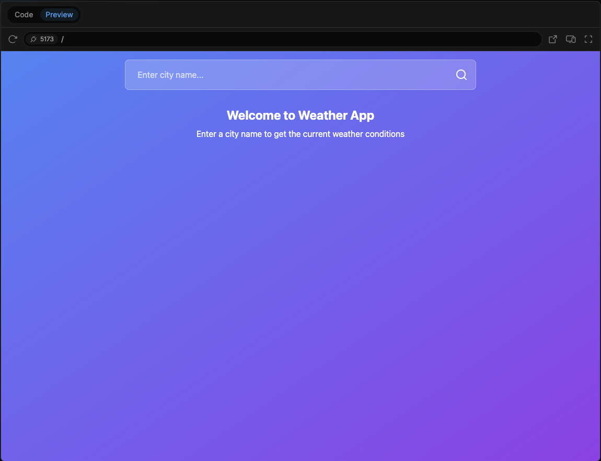
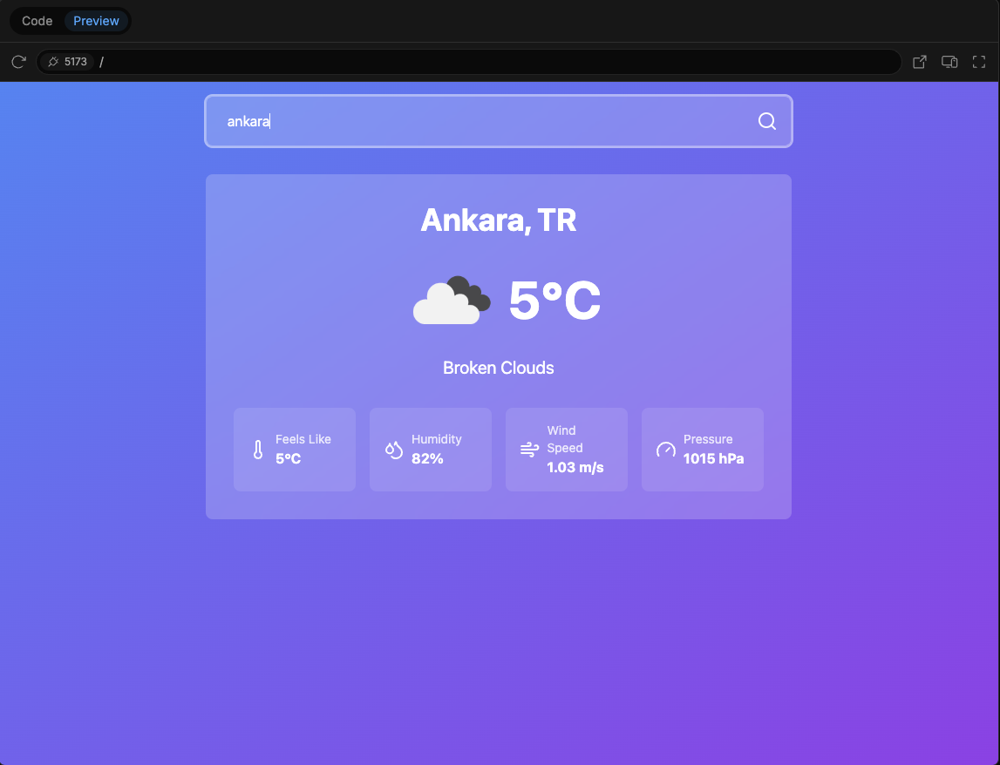

# Hava Durumu Uygulaması (Vanilla JavaScript)

## Proje Tanıtımı

Bu proje, şehir ismi girilerek hava durumu bilgilerini getiren basit bir **hava durumu uygulamasıdır**. Kullanıcı, arama kutusuna bir şehir adı yazıp **arama butonuna tıkladığında**, ilgili şehrin güncel hava durumu bilgileri ekrana yansıtılır.

Uygulama **Vanilla JavaScript** ile geliştirilmiştir ve UI tasarımı **Bolt.new** kullanılarak oluşturulmuştur. Ancak, uygulama herhangi bir framework veya kütüphane olmadan saf JavaScript ile yeniden yazılmıştır.

## Kullanılan Teknolojiler

- **HTML**: Sayfa yapısı
- **CSS**: Şık ve modern tasarım
- **JavaScript (VanillaJS)**: API çağrıları ve dinamik içerik yönetimi
- **OpenWeather API**: Güncel hava durumu verilerini almak için kullanıldı

## Uygulama Özellikleri

- Kullanıcı, bir şehir ismi girerek hava durumu verilerini alabilir.
- Gelen hava durumu verileri **şehir adı, sıcaklık, hava durumu durumu, rüzgar hızı, basınç ve hissedilen sıcaklık** bilgilerini içerir.
- **Arama sonrası veriler sıfırlanır** ve yeni bir arama için giriş alanı temizlenir.
- Şık ve modern bir UI tasarımına sahiptir.

## Kurulum ve Kullanım

1. Proje dosyalarını indirin veya kopyalayın.
2. **index.html** dosyasını bir tarayıcıda açın.
3. Şehir ismini girerek hava durumunu görüntüleyin.

## Canlı Demo

Projeyi test etmek için aşağıdaki bağlantıya tıklayarak canlı sürümünü görüntüleyebilirsiniz:
🔗 Hava Durumu Uygulaması

## Kod Açıklamaları

Aşağıda, ana fonksiyonun nasıl çalıştığını özetleyen kod parçacıkları verilmiştir:

```js
const apiKey = "YOUR_API_KEY";
const searchBox = document.getElementById("searchBox");
const searchButton = document.getElementById("searchButton");
const resultContainer = document.getElementById("resultContainer");

searchButton.addEventListener("click", async () => {
  const city = searchBox.value.trim();
  if (!city) return;

  const response = await fetch(
    `https://api.openweathermap.org/data/2.5/weather?q=${city}&appid=${apiKey}&units=metric`
  );
  const data = await response.json();

  resultContainer.innerHTML = `
        <h2>${data.name}, ${data.sys.country}</h2>
        <p>${data.weather[0].description}</p>
        <p>${data.main.temp}°C</p>
    `;

  searchBox.value = "";
});
```

### Önemli Noktalar:

- API anahtarınızı **YOUR_API_KEY** yerine kendi OpenWeather API anahtarınızla değiştirin.
- Arama sonrası **searchBox.value = "";** ile giriş alanı temizleniyor.

## Ekran Görüntüleri

Aşağıda uygulamanın önizleme görüntüleri bulunmaktadır:

### Başlangıç Ekranı:



### Arama Sonucu:


